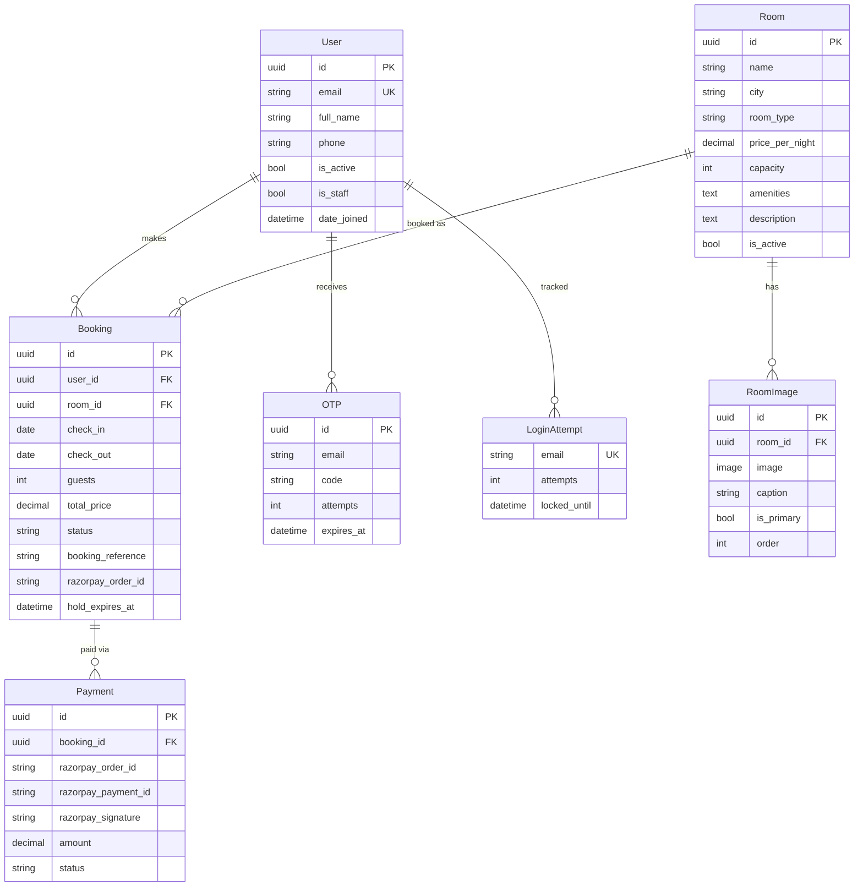

<p align="center">
  <h1 align="center">🏨 GrandStay — Hotel Booking Platform</h1>
  <p align="center">
    A full-stack hotel booking web application with secure authentication, real-time room search, Razorpay payment integration, and a powerful admin dashboard.
  </p>
  <p align="center">
    
    
    
    
    
  </p>
</p>

---

## 📑 Table of Contents

- [Overview](#-overview)
- [Architecture](#-architecture)
- [Project Structure](#-project-structure)
- [Tech Stack](#-tech-stack)
- [Features](#-features)
- [Database Schema](#-database-schema)
- [API Reference](#-api-reference)
- [Getting Started](#-getting-started)
- [Environment Variables](#-environment-variables)
- [Admin Panel](#-admin-panel)
- [Frontend Pages](#-frontend-pages)
- [User Flows](#-user-flows)
- [Security](#-security)
- [Troubleshooting](#-troubleshooting)
- [Roadmap](#-roadmap)
- [Contributing](#-contributing)
- [License](#-license)

---

## 🌐 Overview

**GrandStay** is a production-grade hotel booking platform built as a **monolithic Django application**. It utilizes Django's server-side rendering for its frontend and integrates a robust API backend for dynamic interactions. The system supports end-to-end flows: from user registration with OTP email verification, to searching rooms with filters, to secure payment processing via Razorpay, to booking management with real-time cancellation.

### Key Highlights

| Aspect | Details |
|--------|---------|
| **Architecture** | Monolithic — Django Templates (SSR) + API Endpoints |
| **Auth** | Email + OTP verification, session-based, rate-limited login |
| **Payments** | Razorpay SDK with HMAC-SHA256 signature verification |
| **Admin** | Django Unfold UI with inline image uploads, live stats dashboard |
| **Database** | SQLite (development), PostgreSQL-ready |

---

## 🏗 Architecture

```
┌──────────────────────────────────────────────────────────────────┐
│                    DJANGO MONOLITH (Port 8000)                   │
│                                                                  │
│  ┌────────────────────────────────────────────────────────────┐  │
│  │                     TEMPLATE ENGINE                        │  │
│  │  ┌────────┐ ┌────────┐ ┌────────┐ ┌──────────────────┐   │  │
│  │  │ index  │ │ search │ │ room-  │ │ checkout /       │   │  │
│  │  │ .html  │ │ .html  │ │ details│ │ confirmation     │   │  │
│  │  └────────┘ └────────┘ └────────┘ └──────────────────┘   │  │
│  └───────────────────────────┬────────────────────────────────┘  │
│                              │ Context & Internal APIs           │
│                              ▼                                   │
│  ┌────────────────────────────────────────────────────────────┐  │
│  │                    API / CONTROLLERS                       │  │
│  │  ┌──────────────┐  ┌──────────────┐  ┌─────────────────┐   │  │
│  │  │  accounts/   │  │   rooms/     │  │    payments/    │   │  │
│  │  │ • Register   │  │ • Search     │  │ • Create Order  │   │  │
│  │  │ • Verify OTP │  │ • Detail     │  │ • Verify Pay    │   │  │
│  │  │ • Login      │  │ • Hold Room  │  │ • Webhook       │   │  │
│  │  │ • Logout     │  │ • Cancel     │  │                 │   │  │
│  │  └──────────────┘  └──────────────┘  └─────────────────┘   │  │
│  └───────────────────────────┬────────────────────────────────┘  │
│                              │                                   │
│              ┌───────────────┴───────────────┐                   │
│              │          SQLite / DB          │                   │
│              └───────────────────────────────┘                   │
│                                                                  │
│  External Services:                                              │
│  ┌───────────────┐  ┌──────────────────┐                         │
│  │ Gmail SMTP    │  │ Razorpay API     │                         │
│  │ (OTP emails,  │  │ (orders, verify, │                         │
│  │  confirmations│  │  webhooks)       │                         │
│  └───────────────┘  └──────────────────┘                         │
└──────────────────────────────────────────────────────────────────┘
```

---

## 📂 Project Structure

```
Hotel_booking_P1/
│
├── manage.py                    # Django entry point
├── requirements.txt             # Python dependencies
├── .env                         # Secret keys & config (not in git)
├── .env.example                 # Template for .env setup
├── .gitignore                   # Git exclusion rules
│
├── hotel_booking/               # ⚙️ Django project config
│   ├── settings.py              #   All settings (DB, CORS, SMTP, Razorpay, OTP)
│   ├── urls.py                  #   Root URL router + media serving
│   ├── wsgi.py                  #   WSGI application
│   └── asgi.py                  #   ASGI application
│
├── accounts/                    # 👤 Authentication app
│   ├── models.py                #   User (email-based), OTP, LoginAttempt
│   ├── managers.py              #   Custom UserManager
│   ├── views.py                 #   Register, VerifyOTP, Login, Logout, Me
│   ├── serializers.py           #   Input validation & response formatting
│   ├── backends.py              #   CSRF-exempt session authentication
│   ├── utils.py                 #   OTP generation, email sending helpers
│   ├── admin.py                 #   User & OTP admin panels
│   └── urls.py                  #   /accounts/* routes
│
├── rooms/                       # 🏠 Rooms & Bookings app
│   ├── models.py                #   Room, RoomImage, Booking
│   ├── views.py                 #   Search, Detail, Hold, Cancel, MyBookings, Confirm
│   ├── serializers.py           #   RoomSerializer, RoomImageSerializer, BookingSerializer
│   ├── admin.py                 #   Room admin with inline image uploads
│   ├── urls.py                  #   /rooms/* routes
│   ├── booking_urls.py          #   /bookings/* routes
│   └── management/
│       └── commands/
│           └── seed_rooms.py    #   Seed 15 sample rooms across 5 cities
│
├── payments/                    # 💳 Razorpay payment app
│   ├── models.py                #   Payment (order_id, payment_id, signature, status)
│   ├── views.py                 #   CreateOrder, VerifyPayment, Webhook
│   ├── serializers.py           #   Payment data serializers
│   ├── utils.py                 #   Razorpay client initialization
│   ├── admin.py                 #   Payment admin panel
│   └── urls.py                  #   /payments/* routes
│
├── templates/                   # 🎨 Django HTML Templates
│   ├── base.html                #   Master layout and navigation
│   ├── index.html               #   Landing page with search form
│   ├── accounts/                #   Auth pages (login, register)
│   ├── rooms/                   #   Room search and details pages
│   ├── bookings/                #   My bookings and confirmation pages
│   ├── payments/                #   Checkout page
│   ├── admin/                   #   Admin customizations
│   │   └── base_site.html       #   Custom Unfold admin dashboard
│   └── emails/                  #   Email templates
│       ├── otp_email.html       #   OTP verification email (styled HTML)
│       └── booking_confirmation.html  # Post-payment confirmation email
│
├── static/                      # 🖼️ Static Assets
│   ├── css/
│   │   └── style.css            #   Global design system & component styles
│   ├── js/
│   │   └── auth.js              #   Auth state management & navbar updates
│   └── images/
│       └── room-hero.png        #   Default room hero image
│
├── media/                       # 📸 User-uploaded files (not in git)
│   └── room_images/             #   Admin-uploaded room photos
│
└── db.sqlite3                   # 🗄️ SQLite database (not in git)
```

---

## 🛠 Tech Stack

### Backend

| Technology | Purpose |
|-----------|---------|
| **Python 3.12+** | Core language |
| **Django 5.1** | Web framework |
| **Django REST Framework 3.15** | API layer |
| **SQLite** | Database (development) |
| **Razorpay Python SDK** | Payment gateway |
| **Pillow** | Image processing for room photos |
| **bcrypt** | Secure password hashing |
| **python-decouple** | Environment variable management |
| **django-cors-headers** | Cross-Origin Request handling |
| **django-unfold** | Premium admin dashboard UI |

### Frontend

| Technology | Purpose |
|-----------|---------|
| **HTML5** | Semantic page structure |
| **Vanilla CSS** | Custom design system with CSS variables |
| **Vanilla JavaScript** | DOM manipulation, fetch API, dynamic UI |
| **Razorpay Checkout.js** | Payment modal integration |

---

## ✨ Features

### 🔐 Authentication System
- **Email-based registration** — no usernames, email is the unique identifier
- **6-digit OTP verification** via Gmail SMTP with styled HTML emails
- **Rate-limited login** — account locks after 5 failed attempts for 15 minutes
- **Session-based auth** — 24-hour sessions with HTTP-only cookies
- **Dynamic navbar** — auto-detects logged-in/guest state across all pages

### 🔍 Room Search & Discovery
- **City-based search** with date range and guest count
- **Live filters** — room type (Single/Double/Deluxe), price range slider, sort order
- **Dynamic URL parameters** — shareable search result links
- **Room Detail Page** — hero image, amenities grid with icons, hotel policies, photo gallery
- **Dynamic room images** — admin-uploaded photos served via Django media

### 💰 Booking & Payment
- **10-minute room hold** — reserves availability while user completes payment
- **Razorpay integration** — secure order creation + HMAC-SHA256 signature verification
- **Webhook support** — server-side payment confirmation as a fallback
- **Booking confirmation emails** — styled HTML emails sent after successful payment
- **Unique booking reference** — format: `GS-XXXXXXXX` for each confirmed booking

### 📊 Booking Management Dashboard
- **Stats bar** — total bookings, confirmed count, pending count, total spent
- **Tabbed view** — Upcoming / Past / All bookings
- **Real-time cancellation** — confirmation modal → animated card removal → toast notification
- **Payment completion** — pending bookings show "Complete Payment" button
- **Rich booking cards** — room name, status badge, dates, guests, city, reference, price breakdown

### 🛡️ Admin Panel (Django Unfold)
- **Custom dashboard** — live stats, today's check-ins, revenue
- **Room management** — inline multi-image uploads with preview thumbnails
- **Booking management** — status filters, date hierarchy, search by reference/email
- **Payment tracking** — full Razorpay transaction audit trail
- **User management** — OTP status, account activation

---

## 🗄 Database Schema



### Booking Statuses

| Status | Meaning |
|--------|---------|
| `pending` | Room is held, awaiting payment (10-min TTL) |
| `confirmed` | Payment verified, booking is active |
| `cancelled` | User-cancelled (allowed >24h before check-in) |
| `expired` | Hold timed out without payment |
| `failed` | Payment attempt failed |

---

## 📡 API Reference

### Authentication — `/accounts/`

| Method | Endpoint | Auth | Description |
|--------|----------|------|-------------|
| `POST` | `/accounts/register/` | ❌ | Register new user (sends OTP email) |
| `POST` | `/accounts/verify-otp/` | ❌ | Verify 6-digit OTP to activate account |
| `POST` | `/accounts/resend-otp/` | ❌ | Resend OTP to email |
| `POST` | `/accounts/login/` | ❌ | Login with email + password (rate-limited) |
| `POST` | `/accounts/logout/` | ✅ | Destroy session |
| `GET`  | `/accounts/me/` | ✅ | Get current authenticated user info |

### Rooms — `/rooms/`

| Method | Endpoint | Auth | Description |
|--------|----------|------|-------------|
| `GET` | `/rooms/search/?city=Mumbai&check_in=2026-05-01&check_out=2026-05-03&guests=2` | ❌ | Search available rooms with filters |
| `GET` | `/rooms/<room_id>/` | ❌ | Get full room details + images |

**Search Query Parameters:**

| Param | Type | Required | Description |
|-------|------|----------|-------------|
| `city` | string | ✅ | City name (case-insensitive) |
| `check_in` | date | ✅ | Check-in date (YYYY-MM-DD) |
| `check_out` | date | ✅ | Check-out date (YYYY-MM-DD) |
| `guests` | int | ✅ | Number of guests (min: 1) |
| `room_type` | string | ❌ | Filter: `single`, `double`, or `deluxe` |
| `min_price` | decimal | ❌ | Minimum price per night |
| `max_price` | decimal | ❌ | Maximum price per night |
| `sort` | string | ❌ | `price_asc` (default) or `price_desc` |

### Bookings — `/bookings/`

| Method | Endpoint | Auth | Description |
|--------|----------|------|-------------|
| `POST` | `/bookings/hold/` | ✅ | Hold a room for 10 minutes |
| `GET` | `/bookings/<booking_id>/` | ✅ | Get booking details |
| `POST` | `/bookings/<booking_id>/cancel/` | ✅ | Cancel a booking (>24h before check-in) |
| `GET` | `/bookings/ref/<booking_ref>/confirmation/` | ✅ | Get confirmation page data |
| `GET` | `/bookings/my/` | ✅ | List user's upcoming & past bookings |

### Payments — `/payments/`

| Method | Endpoint | Auth | Description |
|--------|----------|------|-------------|
| `POST` | `/payments/create-order/` | ✅ | Create Razorpay order for a booking |
| `POST` | `/payments/verify/` | ✅ | Verify payment signature (HMAC-SHA256) |
| `POST` | `/payments/webhook/` | ❌ | Razorpay webhook callback |

---

## 🚀 Getting Started

### Prerequisites

- **Python 3.12+** — [Download](https://www.python.org/downloads/)
- **Git** — [Download](https://git-scm.com/)
- **Gmail Account** — with [App Password](https://myaccount.google.com/apppasswords) enabled
- **Razorpay Account** — [Sign up](https://dashboard.razorpay.com/) for test keys

### 1. Clone the Repository

```bash
git clone https://github.com/Rohinth-KR/HotelBookingWeb.git
cd HotelBookingWeb
```

### 2. Set Up Virtual Environment

```bash
# Windows
python -m venv venv
venv\Scripts\activate

# macOS/Linux
python3 -m venv venv
source venv/bin/activate
```

### 3. Install Dependencies

```bash
pip install -r requirements.txt
```

### 4. Configure Environment Variables

```bash
# Copy the example and fill in your keys
cp .env.example .env
```

Edit `.env` with your actual credentials (see [Environment Variables](#-environment-variables) section).

### 5. Run Database Migrations

```bash
python manage.py migrate
```

### 6. Create Admin Superuser

```bash
python manage.py createsuperuser
```

### 7. Seed Sample Data (Optional)

```bash
python manage.py seed_rooms
```

This creates 15 rooms across 5 Indian cities (Mumbai, Delhi, Bangalore, Goa, Jaipur) with varied types and pricing.

### 8. Start the Server

```bash
python manage.py runserver
# Running at http://127.0.0.1:8000
```

### 9. Open the App

Navigate to **http://127.0.0.1:8000/** in your browser to view the site.

Admin Panel: **http://127.0.0.1:8000/admin/**

---

## 🔑 Environment Variables

Create a `.env` file in the project root with the following variables:

```env
# Django
SECRET_KEY=your-super-secret-key-change-in-production
DEBUG=True
ALLOWED_HOSTS=localhost,127.0.0.1

# Gmail SMTP (for sending OTP & confirmation emails)
EMAIL_HOST_USER=your_gmail@gmail.com
EMAIL_HOST_PASSWORD=your-16-char-app-password

# Razorpay (get keys from https://dashboard.razorpay.com/app/keys)
RAZORPAY_KEY_ID=rzp_test_xxxxxxxxxxxxx
RAZORPAY_KEY_SECRET=your_razorpay_key_secret
RAZORPAY_WEBHOOK_SECRET=your_webhook_secret
```

### How to Get Each Key

| Variable | How to Obtain |
|----------|---------------|
| `SECRET_KEY` | Generate via `python -c "from django.core.management.utils import get_random_secret_key; print(get_random_secret_key())"` |
| `EMAIL_HOST_PASSWORD` | Google Account → Security → 2FA → App Passwords → Generate for "Mail" |
| `RAZORPAY_KEY_ID` | Razorpay Dashboard → Settings → API Keys → Key ID |
| `RAZORPAY_KEY_SECRET` | Razorpay Dashboard → Settings → API Keys → Key Secret |
| `RAZORPAY_WEBHOOK_SECRET` | Razorpay Dashboard → Settings → Webhooks → Create → Secret |

> ⚠️ **Never commit `.env` to git.** It's already in `.gitignore`.

---

## 🛡️ Admin Panel

Access at **http://127.0.0.1:8000/admin/** with your superuser credentials.

### What You Can Do

| Section | Capabilities |
|---------|-------------|
| **Rooms** | Add/edit rooms, set pricing, upload multiple images with primary selection, manage amenities |
| **Bookings** | View all bookings, filter by status/city/date, search by reference or email, manual status changes |
| **Payments** | Full audit trail of every Razorpay transaction |
| **Users** | Manage accounts, check activation status, view OTPs |
| **Dashboard** | Live stats — today's bookings, revenue, upcoming check-ins |

### Uploading Room Images

1. Go to **Rooms** → Click any room
2. Scroll to **"Room images"** section at the bottom
3. Click **"Add another Room image"**
4. Upload a photo, add an optional caption
5. Check **"Is primary"** for the hero/thumbnail image
6. Set **"Order"** for gallery sequence (lower = first)
7. Save — images appear instantly on the frontend

---

## 🎨 Frontend Pages

| Page | URL | Description |
|------|-----|-------------|
| **Home** | `/index.html` | Landing page with search form (city, dates, guests) |
| **Register** | `/register.html` | Sign up form → OTP verification in same page |
| **Login** | `/login.html` | Email + password login |
| **Search** | `/search.html` | Search results with sidebar filters (type, price, sort) |
| **Room Details** | `/room-details.html?id=...` | Hero image, amenities grid, photo gallery, booking sidebar |
| **Checkout** | `/checkout.html?booking_id=...` | Booking summary + Razorpay payment modal |
| **Confirmation** | `/confirmation.html?ref=...` | Post-payment success page with booking details |
| **My Bookings** | `/my-bookings.html` | Booking dashboard with stats, tabs, cancellation |

---

## 🔄 User Flows

### Registration Flow
```
Register Page → Enter Details → POST /accounts/register/
    → OTP Email Sent → Enter OTP → POST /accounts/verify-otp/
    → Account Activated → Auto-Login → Redirect to Home
```

### Booking Flow
```
Home → Search Rooms → POST /rooms/search/
    → View Results → Click Room → GET /rooms/<id>/
    → Room Details Page → Click "Book Now" → POST /bookings/hold/
    → 10-min Hold Created → Redirect to Checkout
    → POST /payments/create-order/ → Razorpay Modal Opens
    → User Pays → POST /payments/verify/ → Signature Verified
    → Booking Confirmed → Confirmation Email Sent
    → Redirect to Confirmation Page
```

### Cancellation Flow
```
My Bookings → Click "Cancel Booking" → Confirmation Modal
    → Click "Yes, Cancel It" → POST /bookings/<id>/cancel/
    → Booking Status → "cancelled" → Room Availability Restored
    → Toast Notification → Card Animates Out → List Refreshes
```

---

## 🔒 Security

| Measure | Implementation |
|---------|---------------|
| **Password Hashing** | bcrypt with salt rounds |
| **Session Auth** | HTTP-only cookies, 24h expiry |
| **CSRF Protection** | Django middleware (exempted for API via custom backend) |
| **CORS** | Whitelist-based in production, allow-all only in DEBUG |
| **Login Rate Limiting** | 5 attempts → 15-minute account lock |
| **OTP Protection** | 3 max attempts per OTP, 10-minute expiry |
| **Payment Security** | Razorpay HMAC-SHA256 signature verification |
| **Webhook Verification** | Server-side signature validation |
| **Environment Secrets** | All keys in `.env`, never hardcoded |
| **Password Validation** | Min 8 chars, not similar to user info, not common |

---

## 🐛 Troubleshooting

### Common Issues

<details>
<summary><strong>OTP emails not arriving</strong></summary>

1. Verify `EMAIL_HOST_USER` and `EMAIL_HOST_PASSWORD` in `.env` have no trailing spaces
2. Ensure you're using a **Gmail App Password** (not your regular password)
3. Enable 2-Factor Authentication on your Google account first
4. Check spam/junk folder
5. Test SMTP: `python manage.py shell` → `from django.core.mail import send_mail; send_mail('Test', 'Body', None, ['your@email.com'])`
</details>

<details>
<summary><strong>Razorpay "Payment service unavailable"</strong></summary>

1. Check `RAZORPAY_KEY_ID` and `RAZORPAY_KEY_SECRET` in `.env`
2. Ensure keys don't have extra spaces or quotes
3. Verify keys at [Razorpay Dashboard](https://dashboard.razorpay.com/app/keys)
4. Restart the Django server after changing `.env`
</details>

<details>
<summary><strong>CORS errors in browser console</strong></summary>

1. Ensure `django-cors-headers` is installed: `pip install django-cors-headers`
2. Verify `corsheaders` is in `INSTALLED_APPS` and middleware is ordered correctly
3. Check that `CORS_ALLOW_CREDENTIALS = True` in settings
4. Frontend must use `credentials: 'include'` in all `fetch()` calls
</details>

<details>
<summary><strong>Room images not loading</strong></summary>

1. Verify `MEDIA_URL` and `MEDIA_ROOT` are configured in `settings.py`
2. Check that media URL pattern is added in `urls.py` (only needed in DEBUG)
3. Ensure `Pillow` is installed: `pip install Pillow`
4. Uploaded images go to `media/room_images/` directory
</details>

<details>
<summary><strong>"Room not available" when booking</strong></summary>

This means another booking overlaps the selected dates. The system checks for date conflicts with `confirmed` and `pending` bookings. Try different dates or wait for pending holds to expire (10 minutes).
</details>

---

## 🗺 Roadmap

- [x] Email-based authentication with OTP
- [x] Room search with filters
- [x] Room details with dynamic images
- [x] Razorpay payment integration
- [x] Booking management dashboard with cancellation
- [x] Admin panel with inline image uploads
- [ ] Password reset / forgot password flow
- [ ] User profile page with edit capability
- [ ] Room reviews and ratings
- [ ] Email notifications for upcoming check-ins
- [ ] Production deployment (Whitenoise, PostgreSQL, Gunicorn)
- [ ] Mobile-responsive PWA support

---

## 🤝 Contributing

1. **Fork** the repository
2. **Create** a feature branch: `git checkout -b feature/amazing-feature`
3. **Commit** your changes: `git commit -m "Add amazing feature"`
4. **Push** to the branch: `git push origin feature/amazing-feature`
5. **Open** a Pull Request

### Code Style

- Python: Follow PEP 8 conventions
- JavaScript: Use `const`/`let`, template literals, async/await
- CSS: Use CSS custom properties (variables) defined in `style.css`
- Commits: Use descriptive messages (e.g., "Add room image gallery with lightbox")

---

## 📄 License

This project is developed for educational purposes.

---


