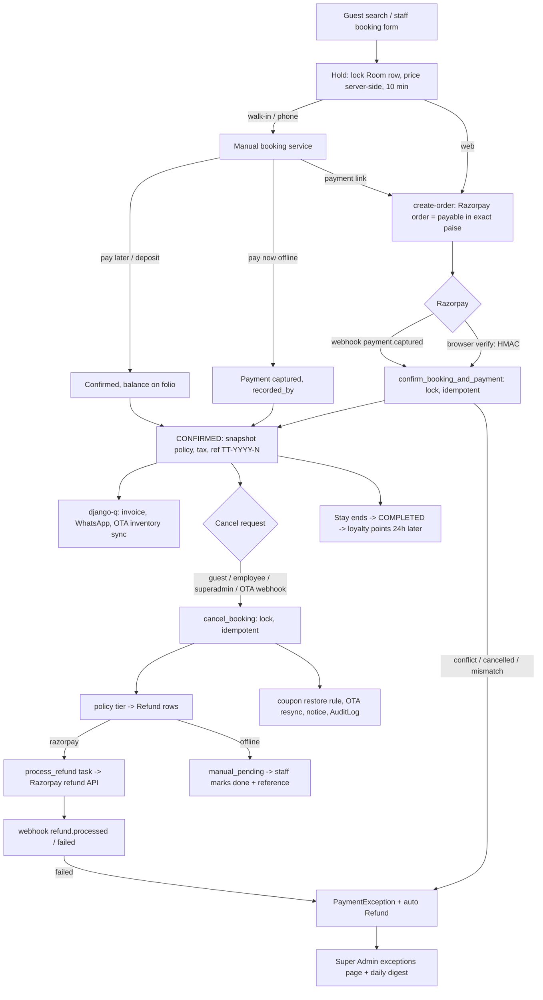

# Plan: Cancellation, Refund, Manual Booking and Payment Reconciliation

Date: 2026-09-29 · Branch: `bugfixes/render-deploy` · Status: PLAN (nothing below is implemented yet)

Goal: one money-safe lifecycle for every booking, whatever its source (web, walk-in, phone, OTA):
**book → pay → change/cancel → refund → reconcile**, with every rupee traceable and every
rule configurable by the Super Admin (project rule: nothing hardcoded).

---

## 1. What exists today (verified in code)

| Area | Current behaviour | Problem |
|------|-------------------|---------|
| Cancel paths | Three separate implementations: guest API `rooms/views.py CancelBookingView`, `superadmin/views.py booking_cancel`, OTA `core/ota/processor.py _handle_booking_cancelled`. Employee admin has **no** cancel. | Rules drift; each path forgets something different (coupon release, OTA resync, refund) |
| Refund | Only the guest path refunds: synchronous Razorpay call, always 100% incl. GST, no policy, no row lock | A double click gives a false "refund failed"; no partial refunds; a Razorpay outage loses the refund silently |
| Refund record | `Payment.refund_id` / `refund_status` (one refund per payment) | No ledger, no partial or multiple refunds, no finance view |
| Refund webhooks | `WebhookView` ignores everything except `payment.captured` / `payment.failed` | Refund outcome never confirmed |
| Cancel metadata | None on `Booking` (who, when, why, which policy) | No audit, no dispute evidence |
| Policy | None | Guests refunded in full up to the minute of check-in |
| Paid but no booking | `ROOM_CONFLICT`, payment on a cancelled booking, `AMOUNT_MISMATCH` only `logger.error("RECONCILIATION NEEDED")` | Guest paid, nothing refunds or alerts anyone |
| Manual bookings | `rooms/services.py create_walk_in_booking`: confirmed instantly, one `Payment` (cash, card_pos, upi_direct, bank_transfer, pay_at_checkout) | No pay-later balance, deposits, partial or later payments; offline refunds undefined; phone bookings cannot collect online |
| Side effects on cancel | Coupon stays redeemed; OTA inventory not resynced (web/admin paths); no guest notification | Room stays blocked on OTAs; guest never told |

## 2. Design principles

1. **One service, every entry point.** `cancel_booking()` is the only code that moves a booking to
   `cancelled`. Guest API, employee portal, superadmin and OTA webhook all call it.
2. **Ledger, not flags.** Money in = `Payment` rows, money out = `Refund` rows. Balance is
   always computed: `payable − Σ captured + Σ refunded`. No stored "paid" boolean.
3. **Policy is a snapshot.** The cancellation terms shown at booking time are copied onto the
   booking, so later policy edits never change a guest's agreed terms.
4. **Refunds are asynchronous, idempotent and retried.** The request only records intent; a
   django-q task talks to Razorpay; webhooks confirm the outcome.
5. **Nothing fails silently.** Any state a human must act on becomes an open `PaymentException`
   row on the Super Admin dashboard (plus a daily digest).
6. **Views stay thin; logic lives in services/models** (project architecture rule).

## 3. Data model

New (all runtime-editable by Super Admin):

```
CancellationPolicy(id, property FK null=global default, name, is_default, is_active)
CancellationPolicyTier(policy FK, min_hours_before_checkin, refund_percent 0-100)
   e.g. (168h,100) (48h,50) (0h,0)  -> the tier with the largest min_hours <= hours left applies

Refund(id, booking FK, payment FK,
       amount, mode[razorpay|cash|upi_direct|bank_transfer|card_pos|adjustment],
       status[requested|processing|processed|failed|manual_pending|manual_done|rejected],
       reason_code[guest_cancel|staff_cancel|ota_cancel|room_conflict|payment_exception|goodwill|no_show],
       policy_percent, override_reason,
       razorpay_refund_id unique null, idempotency_key unique,
       requested_by FK, approved_by FK null,
       attempts, next_retry_at, failure_reason, created_at, processed_at)

PaymentException(id, kind[room_conflict|cancelled_during_payment|amount_mismatch|refund_failed|
                          webhook_orphan], booking FK null, payment FK null,
                 status[open|auto_resolved|resolved], details JSON, resolution_note,
                 resolved_by FK null, created_at, resolved_at)

RefundConfig (singleton): auto_approve_limit, max_retry_attempts, gateway_fee_policy, digest_recipients
```

Changed:

```
Booking  += cancelled_at, cancelled_by FK, cancellation_source[guest|staff|superadmin|ota|system],
            cancellation_reason, policy_snapshot JSON (tiers + name at confirmation)
Payment  += recorded_by FK, reference, received_at      (offline payments: who took it, receipt no.)
Payment.status += partially_refunded
```

`Payment.refund_id/refund_status` stay for compatibility; a data migration copies existing values
into `Refund` rows.

## 4. Booking and money state machine

```
            hold               pay ok                 stay ends
 (none) ─────────▶ PENDING ───────────▶ CONFIRMED ───────────────▶ COMPLETED
                     │  │                  │  │
        expire/fail  │  └─ guest/staff     │  └─ cancel_booking() ─▶ CANCELLED ─▶ Refund(s)
                     ▼     cancel          │
              EXPIRED / FAILED             └─ no-show (Phase 4) ─▶ CANCELLED (fee retained)
```

Payment view of a booking (derived, never stored): `unpaid → partial → paid → partially_refunded → refunded`.

## 5. The cancellation service (`rooms/cancellation.py`)

```
preview_cancellation(booking, now) -> {hours_left, tier, percent, paid, refund_amount,
                                       fee_retained, policy_text, can_cancel, reason_if_not}

cancel_booking(booking_id, actor, source, reason, refund_override=None) -> CancellationResult
  1. transaction.atomic + select_for_update(Booking)                   # serialises double clicks
  2. idempotent: already cancelled -> return the existing result
  3. guard: status in {pending, confirmed}; OTA-sourced bookings only via source=ota
  4. pending  -> release hold + release_coupon(); done (no money moved)
     confirmed:
       a. percent = tier from booking.policy_snapshot for (check_in 14:00 - now)
       b. refundable = Σ captured − Σ refunded ; refund = inr_to_paise(refundable × percent)
       c. override (fin level A / Super Admin only): custom amount or waive fee, reason mandatory
       d. split across captured payments, latest first; one Refund row per payment
          - razorpay payment -> mode=razorpay, status=requested
          - offline payment  -> mode=<original method>, status=manual_pending
       e. set booking cancelled_* fields, status=cancelled
       f. coupon: restore if percent==100 and coupon still valid; otherwise stays redeemed
  5. transaction.on_commit -> enqueue (each idempotent):
       process_refund(refund_id), sync_ota_inventory(room, dates),
       send_cancellation_notice(booking) [email + WhatsApp], AuditLog(BOOKING_CANCELLED)
```

Amounts always go through `payments.utils.inr_to_paise` (already fixed). Invariant enforced in
code and property-tested: **Σ refunds ≤ Σ captured**, per payment and per booking.

## 6. Refund execution

```
Refund(requested) ──task process_refund──▶ Razorpay refund API (receipt=idempotency_key)
      │ transient error: retry with backoff (RefundConfig.max_retry_attempts)
      │ permanent error / retries exhausted: status=failed + PaymentException(refund_failed)
      ▼
 status=processing, razorpay_refund_id saved
      │ webhook refund.processed (or poll task after N minutes)  -> processed, email "refund on its way"
      │ webhook refund.failed                                    -> failed + PaymentException
```

- Webhook handling reuses `ProcessedWebhookEvent` for replay protection.
- Offline refunds: `manual_pending` appears on the staff "Refunds due" list. Staff with fin level
  A/B enter the reference (cash voucher, UPI txn id, bank UTR) and mark `manual_done`.
- Razorpay does not return its fee on refunds; default policy: the property absorbs it
  (`RefundConfig.gateway_fee_policy` lets Super Admin change that).

## 7. Who can do what

| Action | Guest | Employee C | Employee B | Employee A / Super Admin |
|--------|-------|-----------|-----------|--------------------------|
| Cancel own booking per policy | ✅ (web bookings only) | | | |
| Cancel any assigned-property booking | | ✅ (refund created, needs approval) | ✅ policy refund auto-approved up to limit | ✅ |
| Override refund (waive fee, custom amount, goodwill) | | | | ✅ reason mandatory, AuditLog |
| Approve refunds above `auto_approve_limit` | | | | ✅ |
| Mark offline refund paid | | | ✅ | ✅ |
| Edit policies / RefundConfig | | | | Super Admin only |

Employee properties scoping already exists (`_assigned_rooms`) and is reused.

## 8. Manual bookings (walk-in / phone / OTA-adjacent) — done properly

1. **One booking-creation service** with `source` and `payment_mode`:
   - `pay_now_offline` (cash, card POS, direct UPI, bank transfer): confirmed, `Payment` captured.
   - `pay_later` (pay at checkout): confirmed, no captured payment; balance shows on the folio;
     optional `balance_due_by` date and reminder task.
   - `deposit`: confirmed with partial payment; remaining balance tracked.
   - `payment_link` (phone bookings): Razorpay Payment Link sent by SMS/WhatsApp/email; when paid
     (`payment_link.paid` webhook) the same `confirm_booking_and_payment` service confirms it; the
     room is held for the link's expiry.
2. **`record_offline_payment(booking, method, amount, reference, staff)`**: adds a captured
   `Payment`, stamps `recorded_by`, prints or emails a receipt. Can be called any time (deposit,
   balance at checkout).
3. **Folio ledger** (`accounts` folio page and staff booking detail): payable, payments (each with
   method, reference, who), refunds, balance due or refundable. One source for all totals.
4. **Same cancellation and refund rules.** The policy snapshot is taken for manual bookings too.
   Unpaid pay-later booking: cancel with no money movement. Offline-paid: `manual_pending` refund.
   Staff may waive with override rules from section 7.
5. **Guardrails** on `price_override`: reason field, only fin level A/B, logged.
6. **Guest self-service scope:** web bookings only. Manual bookings are cancelled by staff; OTA
   bookings are cancelled at the OTA and arrive through the webhook.

## 9. Reconciliation (paid but nothing to deliver)

| Trigger (today only logged) | New behaviour |
|-----------------------------|---------------|
| Payment captured, hold lapsed and room re-booked (`ROOM_CONFLICT`) | `PaymentException` + automatic full `Refund` (reason `room_conflict`) + guest notified with apology and rebooking link |
| Payment captured on a cancelled booking | Same, reason `cancelled_during_payment` |
| `AMOUNT_MISMATCH` | `PaymentException` for manual review; **no** auto-release of the hold (the exact-paise fix removed the common cause); finance decides |
| Webhook for an unknown order | `PaymentException(webhook_orphan)` |
| Refund failed after retries | `PaymentException(refund_failed)` |

Super Admin gets a **Payment exceptions** page (open items, one-click resolve with note) and a
daily digest email from a django-q schedule.

## 10. Notifications

Guest: cancellation confirmed (with policy tier applied and refund amount and ETA), refund
processed, refund failed (we will contact you), payment-exception apology. Staff/finance: new
`manual_pending` refunds, open exceptions digest. Uses existing email + WhatsApp task helpers.

## 11. End-to-end data flow



## 12. Delivery phases

Each phase ships on its own, with tests, migrations and rollback safe. Order matters: 1 before 2, 2 before 3.

**Phase 1: foundations (data + policy)**
- Migrations: `CancellationPolicy(+Tier)`, `Refund`, `PaymentException`, `RefundConfig`, Booking cancel fields, Payment offline fields.
- Data migration: seed the global default policy; copy existing `Payment.refund_id` into `Refund`.
- Snapshot the policy at confirmation (`confirm_booking_and_payment` and walk-in service).
- Super Admin screen: policies and tiers, RefundConfig. AuditLog actions added.
- Tests: tier selection boundaries, snapshot immutability, migration copy.

**Phase 2: cancellation service and refunds**
- `cancel_booking()`, `preview_cancellation()`; new `GET /bookings/<id>/cancel-preview/`.
- Rewire the three existing paths onto the service; add employee cancel with the section 7 matrix.
- `process_refund` task (retry, idempotency), Razorpay refund webhooks, refund status polling fallback.
- Notifications; coupon restore rule; OTA resync on every cancel.
- Guest UI: "Cancel booking" with the preview (refund amount) on the folio page.
- Tests: double-cancel race (TransactionTestCase), Σ refunds ≤ Σ captured (property test over random
  amounts and percents), Razorpay mocked for success, transient failure, permanent failure, webhook replay.

**Phase 3: reconciliation dashboard**
- Auto-refund and `PaymentException` for the four trigger cases; Super Admin exceptions page; daily digest.
- Tests: each trigger produces exactly one exception and one refund, even when the webhook and browser both arrive.

**Phase 4: manual booking and folio**
- `record_offline_payment`, pay-later and deposit modes, balance due reminders, `price_override` guardrails.
- Razorpay Payment Link for phone bookings (`payment_link.paid` webhook into the same confirm service).
- Folio ledger on guest and staff screens; "Refunds due" list for offline refunds.
- Tests: partial then full payment, offline refund flow, link paid twice (idempotent).

**Phase 5 (optional): amend and no-show**
- Extend or shorten stay, room change with price difference (charge or refund via the same ledger).
- No-show marking with policy fee; refund analytics report.

## 13. Migration and rollout

- Additive migrations only; old columns stay until Phase 2 is verified in production.
- Feature flag `CANCELLATION_V2_ENABLED` (env) switches the three cancel entry points to the service, so the old
  behaviour can be restored instantly if Razorpay refunds misbehave in production.
- Test with Razorpay **test mode** end to end before enabling: pay, cancel at each policy tier, confirm the
  refund webhook, then force a refund failure and check the exception appears.
- Existing cancelled bookings keep a null `policy_snapshot`; the UI shows "legacy" for them.

## 14. Decisions needed (recommended defaults in bold)

1. **Default tiers**: **≥7 days before check-in 100%, 2–7 days 50%, under 2 days 0%**. Per-property override is supported.
2. Check-in time used for "hours left": **property check-in time, else 14:00 IST**.
3. Razorpay fee on refunds: **property absorbs it**.
4. Coupon after cancel: **restored only on a 100% refund and if still valid**.
5. Employee authority: **as in section 7** (fin level C cancels, needs approval; A/B approve within limit).
6. Auto-refund in `ROOM_CONFLICT` cases: **yes, full amount, automatically**.
7. `auto_approve_limit` default: **₹10,000** (Super Admin editable).
8. Guest cancels after check-in date: **not allowed online; staff handles as no-show or early checkout**.

## 15. Out of scope here

Partial-stay refunds for early checkout, dynamic-pricing changes, multi-currency, chargeback handling,
OTA-side refund settlement (OTAs handle their own money).
